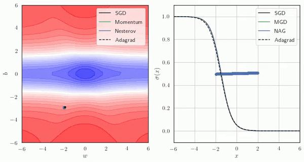

# Gradient Based Optimization Algorithms - Visualized
- These are all the animations used in the Optimization lectures taught by Prof.Mitesh Khapra at IIT Madras in the [Deep Learning course](https://cse.iitm.ac.in/~miteshk/CS6910.html).
- I have uploaded the notebook that I used to create these animations.
- The objective is to get an intuitive idea of the differences in the optimization algorithms with a contrived example for illustration.
- You can find all the animations used in the lecture in .mp4 format in the Animations directory
- Here are a few samples

## Gradient Descent

## Momentum Gradient Descent

## Nesterov Accelarated Gradient Descent

## AdaGrad

## Adam

